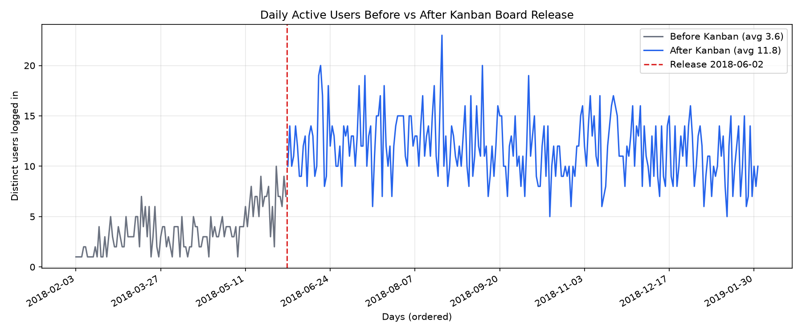
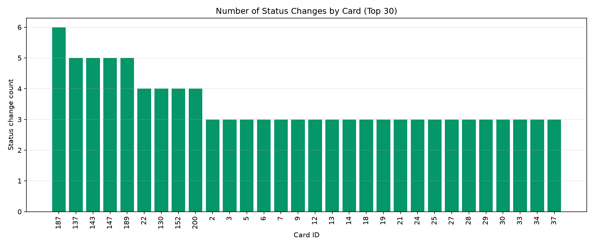

# Shiptivitas Task 3 — Analytics Submission

Kanban Board release date: **2018-06-02**

## Key findings

| Period | Days | Avg DAU |
|--------|------|---------|
| Before Kanban | 110 | **3.63** |
| After Kanban | 245 | **11.79** |

DAU rose about **3.2x** after the Kanban release. Status-change activity also appears only from the release date onward in `card_change_history`.

## Graphs





## SQL queries

See `answer.sql` (also pasted below).

### Part 1 — Daily active users before/after feature change

```sql
-- Daily active users over time
SELECT
  DATE(login_timestamp, 'unixepoch') AS day,
  COUNT(DISTINCT user_id) AS daily_active_users,
  CASE
    WHEN DATE(login_timestamp, 'unixepoch') < '2018-06-02' THEN 'before'
    ELSE 'after'
  END AS period
FROM login_history
GROUP BY day
ORDER BY day;

-- Average DAU before vs after
WITH daily_active_users AS (
  SELECT
    DATE(login_timestamp, 'unixepoch') AS day,
    COUNT(DISTINCT user_id) AS dau
  FROM login_history
  GROUP BY day
)
SELECT
  CASE
    WHEN day < '2018-06-02' THEN 'before'
    ELSE 'after'
  END AS period,
  COUNT(*) AS num_days,
  ROUND(AVG(dau), 2) AS avg_daily_active_users,
  MIN(dau) AS min_dau,
  MAX(dau) AS max_dau
FROM daily_active_users
GROUP BY period
ORDER BY period DESC;
```

### Part 2 — Number of status changes by card

```sql
SELECT
  cch.cardID AS card_id,
  c.name AS card_name,
  c.status AS current_status,
  COUNT(*) AS status_change_count
FROM card_change_history AS cch
LEFT JOIN card AS c
  ON c.id = cch.cardID
WHERE COALESCE(cch.oldStatus, '') != COALESCE(cch.newStatus, '')
GROUP BY cch.cardID
ORDER BY status_change_count DESC, card_id ASC;
```

## Three actionable ideas to grow DAU

### Idea 1 — Daily “What moved today?” digest

1. **Hypothesis:** Users return more often when they get a short daily summary of cards that entered their swimlane or changed status overnight.
2. **Expected Impact:** +10–15% DAU among returning freight managers within 4 weeks by creating a habitual morning check-in.
3. **What the feature is:** An email/in-app digest each morning listing card status changes relevant to the user (new backlog items, cards entering In Progress, cards marked Complete), with deep links into the Kanban board.

### Idea 2 — Personal WIP focus lane + streak

1. **Hypothesis:** Giving each user a personal “Focus” slice of In Progress (with a simple completion streak) increases the reason to open the app every day.
2. **Expected Impact:** +8–12% DAU and higher status-change volume on weekday mornings by turning board usage into a lightweight daily ritual.
3. **What the feature is:** Auto-assign or claim up to N cards in In Progress as “My Focus,” show a streak when the user updates at least one card status each day, and surface Focus cards on the home tab.

### Idea 3 — Stuck-card nudges (aging WIP alerts)

1. **Hypothesis:** Cards that sit too long in one swimlane create support tickets and silent drop-off; nudging owners when a card is aging brings them back and unblocks the board.
2. **Expected Impact:** +5–10% DAU among assignees of aging cards, plus faster time-to-complete for high-priority items.
3. **What the feature is:** Detect cards with no status change for X days (using `card_change_history`), notify the last mover/assignee, and highlight aging cards in the swimlane with a “Needs update” affordance.
